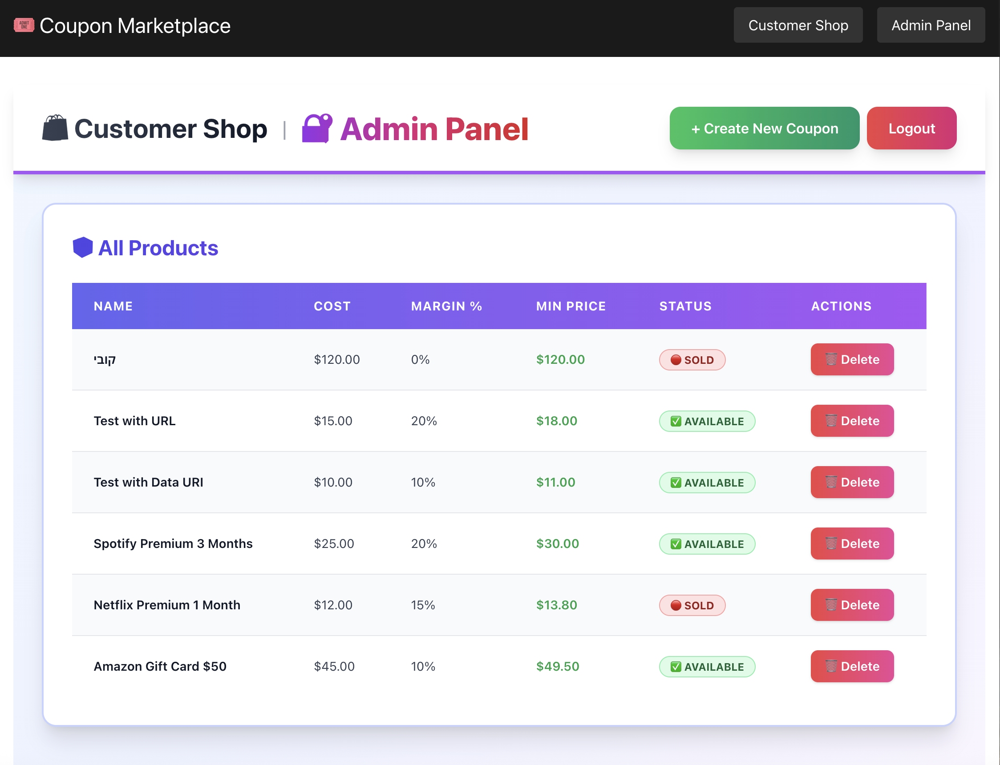

# 🎟️ Digital Coupon Marketplace# 🎟️ Digital Coupon Marketplace# 🎟️ Digital Coupon Marketplace


A **backend-focused full-stack system** for selling digital coupon products through two channels:


- **Direct customers** via the platform UI  A full-stack backend-focused system for selling digital coupon products through two channels:A full-stack backend-focused system for selling digital coupon products through two channels:

- **External resellers** via a secure REST API  


The system enforces **strict pricing rules**, supports **admin product management**, and exposes a **secure reseller API** while maintaining clear business logic boundaries.

- **Direct customers** via the platform UI- **Direct customers** via the platform UI

The project is fully **Dockerized**, includes a minimal **admin interface**, and persists data using **PostgreSQL**.

- **External resellers** via a secure REST API- **External resellers** via a secure REST API

---


# 📑 Table of Contents

The system enforces strict pricing rules, supports product management, and exposes reseller APIs while maintaining clear business logic boundaries.The system enforces strict pricing rules, supports product management, and exposes reseller APIs while maintaining clear business logic boundaries.

- [Architecture](#-architecture)

- [Quick Start](#-quick-start)

- [Features](#-features)

- [Tech Stack](#️-tech-stack)The project is fully **Dockerized**, includes a minimal **admin interface**, and persists data in **PostgreSQL**.The project is fully **Dockerized**, includes a minimal **admin interface**, and persists data in **PostgreSQL**.

- [Pricing Rules](#-pricing-rules)

- [API Examples](#-api-examples)

- [Screenshots](#-screenshots)

- [Testing](#-testing)------

- [Docker](#-docker)

- [Project Structure](#-project-structure)

- [Notes](#-notes)

## 📑 Table of Contents# 🧠 System Overview

---


# 🧱 Architecture

- [Architecture](#-architecture)The system is composed of:

The backend follows a **layered architecture**:

- [Quick Start](#-quick-start)

```

Controller- [Features](#-features)- **Admin Panel** – manage products and pricing

↓

Service Layer- [Tech Stack](#️-tech-stack)- **Customer Storefront** – purchase coupons directly

↓

Business Logic- [API Examples](#-api-examples)- **Reseller API** – external partners can purchase coupons programmatically

↓

Repository / Prisma- [Pricing Rules](#-pricing-rules)- **Pricing Engine** – enforces pricing rules and prevents invalid reseller pricing

↓

Database- [Screenshots](#-screenshots)- **Database** – stores products, coupons, and transactions

```

- [Testing](#-testing)

Key principles:

- [Docker](#-docker)---

- Separation of concerns

- Business logic isolated from controllers- [Project Structure](#-project-structure)

- Pricing rules enforced centrally

- DTO validation- [Notes](#-notes)# 🛠️ Tech Stack


### Architecture Diagram


---Backend


---- **NestJS**


# ⚡ Quick Start## 🧱 Architecture- **TypeScript**


Clone the repository:- **Prisma ORM**


```bash- **PostgreSQL**

git clone https://github.com/KobiSaada/digital-coupon-marketplace

cd digital-coupon-marketplace

```

The backend follows a layered architecture:Frontend

Run the system using Docker:

- **Next.js**

```bash

docker-compose up --build```- **React**

```

Controller- **Tailwind**

Services will start:

   ↓

| Service     | Port | URL                                            |

| ----------- | ---- | ---------------------------------------------- |Service LayerInfrastructure

| Backend API | 3000 | [http://localhost:3000](http://localhost:3000) |

| Frontend    | 3001 | [http://localhost:3001](http://localhost:3001) |   ↓- **Docker**

| PostgreSQL  | 5432 | localhost:5432                                 |

Business Logic- **Docker Compose**

Swagger documentation:

   ↓

```

http://localhost:3000/apiRepository / PrismaAPI

```

   ↓- **REST**

Admin panel:

Database- **Swagger Documentation**

```

http://localhost:3001/admin```

```

---

Credentials:

**Key principles:**

```

admin / admin123- Separation of concerns# 📦 Quick Start

```

- Business logic isolated from controllers

---

- Pricing rules enforced centrallyClone the repository:

# 🚀 Features

- DTO validation

* Dual sales channels (Customer UI + Reseller API)

* Admin product management (CRUD)```bash

* Secure reseller API

* Pricing validation engine**System Components:**git clone https://github.com/YOUR_USERNAME/coupon-marketplace

* Atomic database operations

* JWT authentication- **Admin Panel** – manage products and pricingcd coupon-marketplace

* Random coupon code generation

* Dockerized environment- **Customer Storefront** – purchase coupons directlyRun the system using Docker:

* PostgreSQL persistence

* Swagger API documentation- **Reseller API** – external partners can purchase coupons programmaticallydocker-compose up --build

* 52+ automated tests

- **Pricing Engine** – enforces pricing rules and prevents invalid reseller pricing```

---

- **Database** – stores products, coupons, and transactionsSwagger documentation:

# 🛠️ Tech Stack


### Backend

---http://localhost:3000/api

* NestJS

* TypeScript

* Prisma ORM

* PostgreSQL## 📦 Quick StartFrontend:


### Frontend


* Next.jsClone the repository:http://localhost:3001

* React

* TailwindCSS


### Infrastructure```bash🧩 Domain Model


* Dockergit clone https://github.com/KobiSaada/digital-coupon-marketplaceProduct

* Docker Compose

cd digital-coupon-marketplace

### API

```Represents a sellable item.

* REST

* Swagger


---Run the system using Docker:Fields:


# 💰 Pricing Rules


The system enforces strict pricing validation.```bashid – UUID


### Formuladocker-compose up --build


``````name

minimum_sell_price = cost_price × (1 + margin_percentage / 100)

```


Example:Services will start:description


* Cost: $80

* Margin: 25%

* Minimum Price: $100| Service | Port | URL |type


### Admin Pricing|---------|------|-----|


Admin defines:| Backend API | 3000 | http://localhost:3000 |image_url


* `cost_price`| Frontend | 3001 | http://localhost:3001 |

* `margin_percentage`

| PostgreSQL | 5432 | localhost:5432 |created_at

### Reseller Pricing


Resellers must follow rules:

**Swagger Documentation:**updated_at

✅ Can set `reseller_price` ≥ `minimum_sell_price`  

❌ Cannot sell below minimum price  

❌ Cannot manipulate coupon values

```Coupon Product

### Customer Pricing

http://localhost:3000/api

Customers always pay **exactly the minimum sell price**.

```A product that contains multiple coupons.

All validations occur in the **pricing engine layer**.


---

**Admin Panel:**Additional fields:

# 📡 API Examples


### Authentication

```coupon_code

```bash

curl -X POST http://localhost:3000/auth/admin/login \http://localhost:3001/admin

  -H "Content-Type: application/json" \

  -d '{"username":"admin","password":"admin123"}'```expiration_date

```


### Reseller Purchase

Credentials: `admin` / `admin123`price

```

POST /api/v1/products/{id}/purchase

```

---status

Request:


```json

{## 🚀 Features💰 Pricing Rules

  "reseller_price": 120.00

}

```

- **Dual Sales Channels** – Customer UI + Reseller APIThe system enforces strict pricing logic:

Response:

- **Admin Product Management** – Full CRUD operations

```json

{- **Reseller API** – Secure REST API for external partnersAdmin Pricing

  "product_id": "uuid",

  "final_price": 120.00,- **Pricing Validation Engine** – Server-side pricing rules enforcement

  "value": "NETFLIX-K7X9M2P4"

}- **Atomic Operations** – Database-level locking prevents race conditionsAdmin defines the base product price.

```

- **JWT Authentication** – Secure token-based auth

---

- **Random Coupon Codes** – Dynamic code generation (e.g., `NETFLIX-K7X9M2P4`)Reseller Pricing

# 📸 Screenshots

- **Dockerized Environment** – Full containerization

### Admin Login

- **PostgreSQL Persistence** – Reliable data storageResellers must follow rules:


- **Swagger API Documentation** – Interactive API docs

### Admin Panel

- **52+ Automated Tests** – Comprehensive test coverageCannot sell below minimum allowed price


### Product Management

---Cannot manipulate internal coupon values




### Customer Storefront

## 🛠️ Tech StackAll pricing is validated by backend services


### Purchase Success

### BackendValidation occurs in the pricing engine layer.


- **NestJS** – Progressive Node.js framework

### My Coupons

- **TypeScript** – Type-safe development🔌 Reseller API


- **Prisma ORM** – Type-safe database access

### API Documentation

- **PostgreSQL** – Relational databaseExternal partners can purchase coupons via REST API.


---

### FrontendExample request:

# 🧪 Testing

- **Next.js 14** – React framework

Tests include:

- **React** – UI libraryPOST /api/resellers/purchase

* Business logic validation

* Pricing rule enforcement- **Tailwind CSS** – Utility-first CSS

* API endpoint behavior

* Atomic operationsBody:

* Authentication flows

### Infrastructure

Run tests:

- **Docker** – Containerization{

```bash

cd tests- **Docker Compose** – Multi-container orchestration  "productId": "123",

npm install

npm test  "quantity": 5

```

### API}

Quick API test:

- **REST** – RESTful architecture

```bash

./test-reseller-api.sh- **Swagger** – API documentationResponse:

```


Test coverage:

---{

```

52+ automated tests  "coupons": [

```

## 📡 API Examples    "COUPON-AB123",

---

    "COUPON-XF912"

# 🐳 Docker

### Authentication  ]

The system runs fully inside containers.

}

Services:

```bash

* backend (NestJS API)

* frontend (Next.js UI)curl -X POST http://localhost:3000/auth/admin/login \Security is handled through API tokens.

* postgres (database)

  -H "Content-Type: application/json" \

Start services:

  -d '{"username":"admin","password":"admin123"}'🧱 Architecture

```bash

docker-compose up --build```

```

The backend follows a layered architecture:

View logs:

### Reseller Purchase

```bash

docker-compose logs -fController

```

```bash   ↓

Stop services:

POST /api/v1/products/{id}/purchaseService Layer

```bash

docker-compose down```   ↓

```

Business Logic

Reset database:

**Request:**   ↓

```bash

docker-compose down -vRepository / Prisma

docker-compose up -d

``````json   ↓


---{Database


# 📁 Project Structure  "reseller_price": 120.00


```}Key principles:

backend/

 ├── src/```

 │   ├── admin/

 │   ├── auth/Separation of concerns

 │   ├── customer/

 │   ├── reseller/**Response:**

 │   ├── common/

 │   └── prisma/Business logic isolated from controllers

 │

frontend/```json

 ├── app/

 │   ├── page.tsx{Pricing rules enforced centrally

 │   └── admin/

 │  "product_id": "uuid",

tests/

 ├── reseller.test.js  "final_price": 120.00,DTO validation

 ├── admin.test.js

 └── customer.test.js  "value_type": "STRING",


screenshots/  "value": "NETFLIX-K7X9M2P4"📸 Screenshots


docker-compose.yml}Admin Panel

README.md

``````


---Manage products, pricing, and coupons.


# 📌 Notes### Customer Purchase


This project was created as a backend engineering exercise focusing on:Product Management


* Backend architecture```bash

* Business rule enforcement

* API designPOST /customer/products/{id}/purchaseAdmins can create and edit coupon products.

* Dockerized environments

* Production-like project structure```


---Storefront


# 👨‍💻 AuthorNo authentication required. Customer pays the minimum sell price.


**Koby Saada**  Users can browse and purchase available coupons.

Full-Stack Engineer

---

GitHub: [https://github.com/KobiSaada/digital-coupon-marketplace](https://github.com/KobiSaada/digital-coupon-marketplace)

🧪 Testing

## 💰 Pricing Rules

Tests include:

The system enforces strict pricing logic:

Business logic validation

### Formula

Pricing rule enforcement

```typescript

minimum_sell_price = cost_price × (1 + margin_percentage / 100)API endpoint behavior

```

Run tests:

**Example:**

- Cost: $80npm run test

- Margin: 25%🐳 Docker

- Minimum Price: $100

The project runs fully inside containers.

### Admin Pricing

Services:

Admin defines:

- `cost_price` – Internal costbackend

- `margin_percentage` – Profit margin

frontend

### Reseller Pricing

postgres

Resellers must follow rules:

- ✅ Can set `reseller_price` ≥ `minimum_sell_price`Start everything:

- ✅ Keep the difference as profit

- ❌ Cannot sell below minimum (returns error)docker-compose up --build

- ❌ Cannot manipulate internal coupon values📁 Project Structure

backend

### Customer Pricing ├── src

 │   ├── controllers

- 🔒 Always charged **exactly** `minimum_sell_price` │   ├── services

- 📱 No price negotiation │   ├── pricing

- ⚡ One-click purchase │   ├── repositories

 │   └── modules

**Validation occurs in the pricing engine layer.** │

frontend

--- ├── pages

 ├── components

## 📸 Screenshots └── services


### Admin Logindocker-compose.yml

README.md

🚀 Features


### Admin PanelCoupon marketplace backend


Manage products, pricing, and coupons.Admin product management


Reseller API


### Product ManagementPricing validation engine


Secure token authentication


### Customer StorefrontDockerized environment


Users can browse and purchase available coupons.PostgreSQL persistence


Swagger API docs


### Purchase Success📌 Notes


This project was created as a backend engineering exercise focusing on:


### My Couponsbackend architecture


business rule enforcement


### API DocumentationAPI design


Dockerized environments


---production-like structure


## 🧪 Testing

Tests include:
- Business logic validation
- Pricing rule enforcement
- API endpoint behavior
- Atomic operations
- Authentication flows

Run all tests:

```bash
cd tests
npm install
npm test
```

Quick API validation:

```bash
./test-reseller-api.sh
```

**Test Coverage: 52+ automated tests**

---

## 🐳 Docker

The project runs fully inside containers.

**Services:**
- `backend` – NestJS API
- `frontend` – Next.js UI
- `postgres` – PostgreSQL database

Start everything:

```bash
docker-compose up --build
```

View logs:

```bash
docker-compose logs -f
```

Stop services:

```bash
docker-compose down
```

Reset database:

```bash
docker-compose down -v
docker-compose up -d
```

---

## 📁 Project Structure

```
├── backend/                # NestJS API
│   ├── src/
│   │   ├── admin/         # Admin CRUD module
│   │   ├── auth/          # JWT authentication
│   │   ├── customer/      # Customer endpoints
│   │   ├── reseller/      # Reseller API
│   │   ├── common/        # Shared utilities
│   │   └── prisma/        # Database service
│   └── prisma/
│       ├── schema.prisma  # Database schema
│       └── seed.ts        # Seed data
│
├── frontend/              # Next.js UI
│   ├── app/
│   │   ├── page.tsx      # Customer shop
│   │   └── admin/        # Admin panel
│   └── lib/api.ts        # API client
│
├── tests/                 # Automated tests (52+)
│   ├── reseller.test.js
│   ├── admin.test.js
│   └── customer.test.js
│
├── screenshots/           # Project screenshots
├── docker-compose.yml     # Docker configuration
└── README.md
```

---

## 📌 Notes

This project was created as a backend engineering exercise focusing on:

- **Backend Architecture** – Clean layered structure
- **Business Rule Enforcement** – Server-side validation
- **API Design** – RESTful best practices
- **Dockerized Environments** – Production-ready containers
- **Production-like Structure** – Professional codebase organization

---

## 👨‍💻 Author

**Koby Saada**  
Full-Stack Engineer

---

## 📞 Links

- **GitHub:** https://github.com/KobiSaada/digital-coupon-marketplace
- **API Docs:** http://localhost:3000/api
- **Frontend:** http://localhost:3001

---

<div align="center">

**Made with ❤️ using NestJS + Next.js + PostgreSQL + Docker**

</div>
